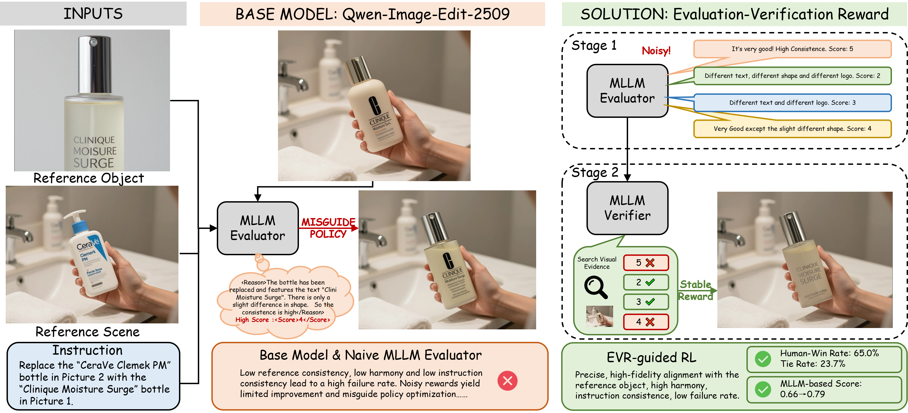

 
<h1 align="center">Evaluation-Verification Reward for Consistent Multi-Reference Image Editing</h1>

<p align="center">
  <a href="https://arxiv.org/abs/2607.29025"></a>
  <a href="https://huggingface.co/datasets/moore12138/EVR_dataset"></a>
  <a href="https://huggingface.co/moore12138/EVR_checkpoint"></a>
</p>

<h3 align="center">Accepted at SIGGRAPH Asia 2026</h3>

## 📖 Overview

While recent image editing models have made rapid progress, multi-reference editing remains challenging, particularly in maintaining visual consistency across references and ensuring overall visual harmony. Reinforcement learning (RL) has proven highly effective for text-to-image generation and single-image editing, but its extension to multi-reference editing is hindered by the absence of suitable reward models that capture multi-image relational constraints. Moreover, naively using multimodal large language models (MLLMs) as zero-shot evaluators faces a key tension between hallucination-prone long-form reasoning and the limited deductive power of short-form judgments. We address these issues with a Multi-dimensional Evaluation-Verification Reward (EVR). EVR decomposes evaluation into distinct visual criteria; for each criterion, an MLLM Evaluator generates multiple candidate hypotheses, and a Verifier checks each claim against visible evidence before reward aggregation, producing more reliable and fine-grained reward signals. Together with a scalable data pipeline, our method enables RL fine-tuning of off-the-shelf editors without architectural changes. Extensive experiments show substantial gains over the base Qwen-Image-Edit, improving consistency and harmony while remaining competitive with strong closed-source editors such as NanoBanana.

<p align="center">
    
</p>

## 🚀 Environment Set Up

Clone this repository and install packages.

```bash
git clone https://github.com/AMAP-ML/EVR.git
cd EVR
conda create -n EVR python=3.10.16
pip install -r requirements.txt

cd reward_server
conda create -n reward python=3.10.19
pip install -r requirements.txt

cd ..
```

## 🗝️ Train

### Download checkpoint:

```Shell
hf download Qwen/Qwen-Image-Edit-2509 --local-dir ckpt/Qwen-Image-Edit
hf download Qwen/Qwen3-VL-8B-Instruct --local-dir ckpt/Qwen3-VL-8B-Instruct
hf download moore12138/EVR_checkpoint --local-dir ckpt/checkpoint
```

### Deploy vLLM Reward Server (Using reward environment)

Set environment variables VLM_URL, VLM_MODEL and VLM_API_KEY (If you have an api key.)

Or depoly vlm server using vLLM:

```
vllm serve ckpt/Qwen3-VL-8B-Instruct --port 8000  --served-model-name Qwen3-VL-8B-Instruct
```

Start the reward server:

```Shell
export VLM_URL=http://0.0.0.0:8000/v1
export VLM_MODEL=Qwen3-VL-8B-Instruct
export VLM_API_KEY='EMPTY'
python reward_server/reward_server.py
```

### Data Format

Download the EVR dataset and place it in`./dataset`: [dataset](https://huggingface.co/datasets/moore12138/EVR_dataset)

```
- dataset
  - ref/      # reference product images
  - fuse/     # scene images containing the product
  - remove/   # scene images with the product removed
  - train_metadata.jsonl
  - test_metadata.jsonl
```

`train_metadata.jsonl` and `test_metadata.jsonl` format (image paths are relative to `dataset/`):

```
{"prompt": "PROMPT", "ref_image": "ref/xxx.png", "target_image": "fuse/yyy.png", "requirement": "TASK_REQUIREMENT"}
...
```

If your dataset lives elsewhere, change `config.dataset` in `config/qwen_image_edit_nft.py`.

### Configure

Change other configures in `config/qwen_image_edit_nft.py`.

### Run Training （Using EVR environment）

```shell
export REWARD_SERVER=[YOUR_REWARD_SERVICE_IP_ADDR]:12343
conda activate EVR
torchrun --nproc_per_node=2 scripts/train_nft_qwen_image_edit.py --config config/qwen_image_edit_nft.py:qwen_mllm_reward
```

## 👍 Acknowledgement

- [**Uniworld**](https://github.com/PKU-YuanGroup/UniWorld): Huge thanks for their elegant codebase 🤩!
- [**DiffusionNFT**](https://github.com/NVlabs/DiffusionNFT): Huge thanks for their elegant codebase 🤩!

## ✏️ Citation

```
@article{miao2026evaluation,
  title={Evaluation-Verification Reward for Consistent Multi-Reference Image Editing},
  author={Miao, Yingmao and Zhang, Pengfei and Lv, Xiaochen and Yu, Meng and Sun, Lei and Chu, Xiangxiang and Shen, Chao and Lin, Chenhao},
  journal={arXiv preprint arXiv:2607.29025},
  year={2026}
}
```
